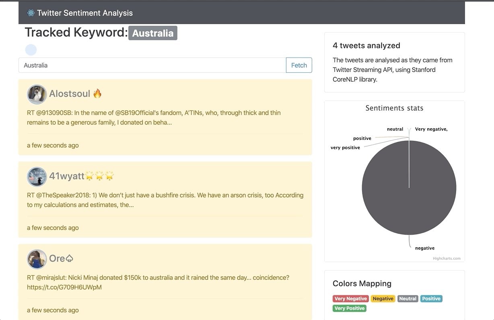

# Analyseur de tweets

<!--
*** Thanks for checking out the Best-README-Template. If you have a suggestion
*** that would make this better, please fork the repo and create a pull request
*** or simply open an issue with the tag "enhancement".
*** Thanks again! Now go create something AMAZING! :D
***
***
***
*** To avoid retyping too much info. Do a search and replace for the following:
*** github_username, repo_name, twitter_handle, email, project_title, project_description
-->


<!-- PROJECT SHIELDS -->
<!--
*** I'm using markdown "reference style" links for readability.
*** Reference links are enclosed in brackets [ ] instead of parentheses ( ).
*** See the bottom of this document for the declaration of the reference variables
*** for contributors-url, forks-url, etc. This is an optional, concise syntax you may use.
*** https://www.markdownguide.org/basic-syntax/#reference-style-links
-->
[![Contributors][contributors-shield]][contributors-url]
[![Forks][forks-shield]][forks-url]
[![Stargazers][stars-shield]][stars-url]
[![Issues][issues-shield]][issues-url]
[![MIT License][license-shield]][license-url]


<!-- PROJECT LOGO -->
<br />
<p align="center">




<h3 align="center">Application Web en ReactJS et back-end Java 8</h3>

  <p align="center">
    À partir de mots-clefs effectue une analyse de tweets en temps réel. 
    <br />
    <a href="https://github.com/Charlene19/sentiment-analysis"><strong>Explore the docs »</strong></a>
    <br />
    <br />
    <a href="https://github.com/Charlene19/sentiment-analysis/issues">Report Bug</a>
    ·
    <a href="href="https://github.com/Charlene19/sentiment-analysis/issues">Request Feature</a>
  </p>

<!-- TABLE OF CONTENTS -->
<details open="open">
  <summary><h2 style="display: inline-block">Table of Contents</h2></summary>
  <ol>
    <li>
      <a href="#about-the-project">À propos du projet</a>
      <ul>
        <li><a href="#built-with">Built avec</a></li>
      </ul>
    </li>
    <li>
      <a href="#getting-started">Démarrer le projet</a>
      <ul>
        <li><a href="#prérequis">Prérequis</a></li>
        <li><a href="#installation">Installation</a></li>
      </ul>
    </li>
    <li><a href="#usage">Usage</a></li>
    <li><a href="#roadmap">Roadmap</a></li>
    <li><a href="#contributing">Contribuer</a></li>
    <li><a href="#license">License</a></li>
    <li><a href="#contact">Contact</a></li>
    <li><a href="#acknowledgements">À savoir</a></li>
  </ol>
</details>


<!-- ABOUT THE PROJECT -->
## About The Project


Ce projet est un fork [d'Aboullaite Med](https://github.com/aboullaite/sentiment-analysis)

C'est un analyseur de tweets en temps réel. Il fonctionne à partir de modèle issu de la biliothèque NLP StandfordCore Nlp. 
À partir de mot-clefs fournis par l'utilisateur, notre modèle va récupérer des tweets relatifs et offrir une analyse selon 
les choix de répartition de notre modèle. 

### Built With

* [Java 8](https://www.java.com/fr/download/help/java8.html)
* [Standford Core NLP](https://stanfordnlp.github.io/CoreNLP/)
* [Spring Boot](https://spring.io/projects/spring-boot)
* [Compte twitter développeur] (https://developer.twitter.com/en)
* [Twitter4J](http://twitter4j.org/)
* [RestAPI](https://restfulapi.net/)  
* [ReactJs](https://fr.reactjs.org/)
* [NodeJs](https://nodejs.org/en/)
* [Npm](https://www.npmjs.com/)


<!-- GETTING STARTED -->
## Démarrer le projet

Il faut se réferer au prérequis. ReactJs nécessite un serveur : NodeJs. IL faut aussi récupérer les token de l'API twitter4J.

### Prérequis

* Java 8

* Compte twitter développeur 

* Maven
  
* NodeJs

* CRA : Create React Application


### Installation

Ce projet peut servir de base :

1. Cloner le repo
   ```sh
   git clone https://github.com/Charlene19/sentiment-analysis
   ```
2. Lancer le back-end
   ```sh
   mvn spring-boot:run
   ```

2. Install NPM packages
   ```sh
   npm install
   ```
2. Lancer le serveur
   ```sh
   npm start
   ```   

<!-- USAGE EXAMPLES -->
## Usage

Un tutoriel en français sera fini dès que le projet sera fini. 

<!-- LICENSE -->
## License

Ce projet est un projet forké utilisant plusieurs bibliothèques : 

StandfordCore Nlp : Distributed under the MIT License. See `LICENSE` for more information.
sentiment-analysis : Aucune licence déclarée par le détenteur initial du fork
Ce projet : est librement exécutable, forkable, modifiable et redistribuable. 

<!-- CONTACT -->
## Contact

Je suis joignable via mon [site](https://charlene19.github.io/)


Project Link:  Link: [https://github.com/Charlene19/sarahProject/](https://github.com/Charlene19/sentiment-analysis)


<!-- ACKNOWLEDGEMENTS -->
## Acknowledgements

* [Template ReadMe](https://github.com/Charlene19/Best-README-Template/edit/master/README.md)


<!-- MARKDOWN LINKS & IMAGES -->
<!-- https://www.markdownguide.org/basic-syntax/#reference-style-links -->
[contributors-shield]: https://img.shields.io/github/contributors/Charlene19/sentiment-analysis.svg?style=for-the-badge
[contributors-url]: https://github.com/Charlene19/sentiment-analysis/graphs/contributors
[forks-shield]: https://img.shields.io/github/forks/Charlene19/sentiment-analysis.svg?style=for-the-badge
[forks-url]:  https://github.com/Charlene19/sentiment-analysis/network/members
[stars-shield]: https://img.shields.io/github/stars/Charlene19/Best-README-Template.svg?style=for-the-badge
[stars-url]: https://github.com/Charlene19/sentiment-analysis/stargazers
[issues-shield]: https://img.shields.io/github/issues/Charlene19/Best-README-Template.svg?style=for-the-badge
[issues-url]: https://github.com/Charlene19/sentiment-analysis/issues
[license-shield]: https://img.shields.io/github/license/Charlene19/Best-README-Template.svg?style=for-the-badge
[license-url]: https://github.com/Charlene19/sentiment-analysis/blob/master/LICENSE.txt


